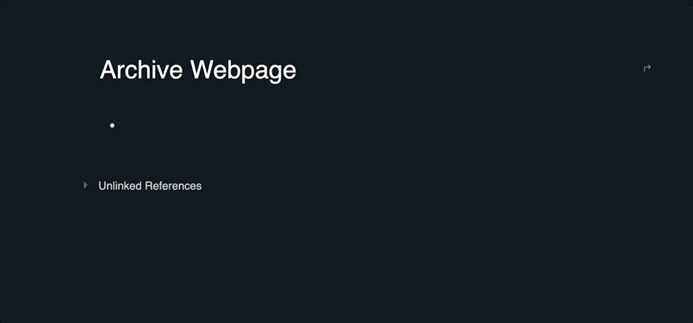

## logseq-archive-webpage

Archive URLs locally directly in Logseq to be viewed offline or in the future, forever.



## Usage

### Slash Command

```
/Archive Webpage
```

### Function Syntax

```
{{renderer archive [URL]}}
```

## Development

### Prerequisites

* [bun](https://bun.sh/) (Required)
* [Logseq Plugin Setup Guide](https://gist.github.com/xyhp915/bb9f67f5b430ac0da2629d586a3e4d69) (Optional)

### Install

```sh
bun install
```

### Build

```
bun run build
```

### Contributors

Feel free to submit a pull request at any time.

### Author

Pat Migliaccio ([patmigliaccio.com](https://patmigliaccio.com)) | [Buy Me a Coffee!](https://www.buymeacoffee.com/patmigliaccio)

### License

This project is licensed under the MIT License - see the [LICENSE](./LICENSE) file for details
